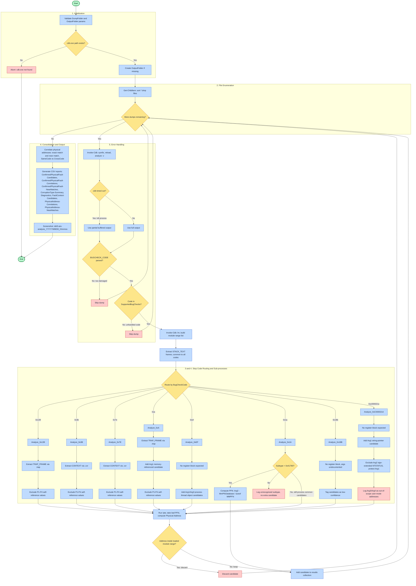
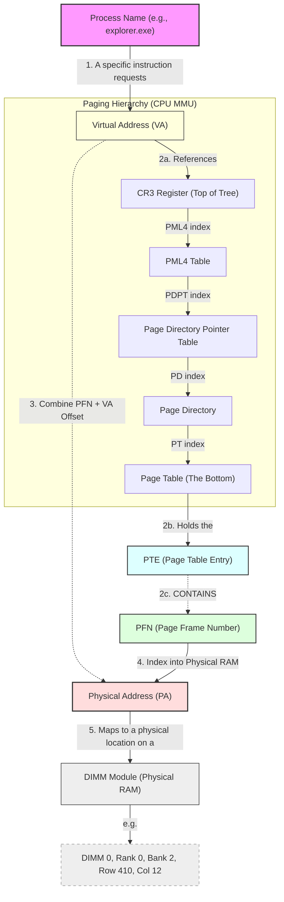
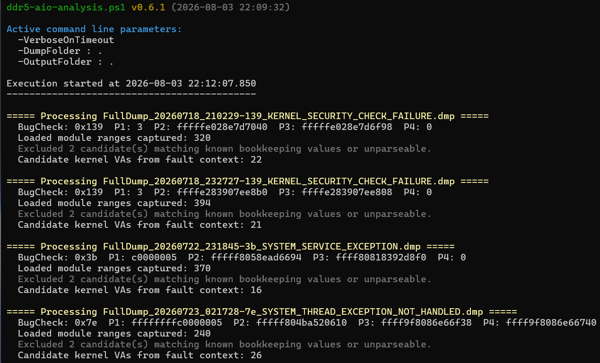
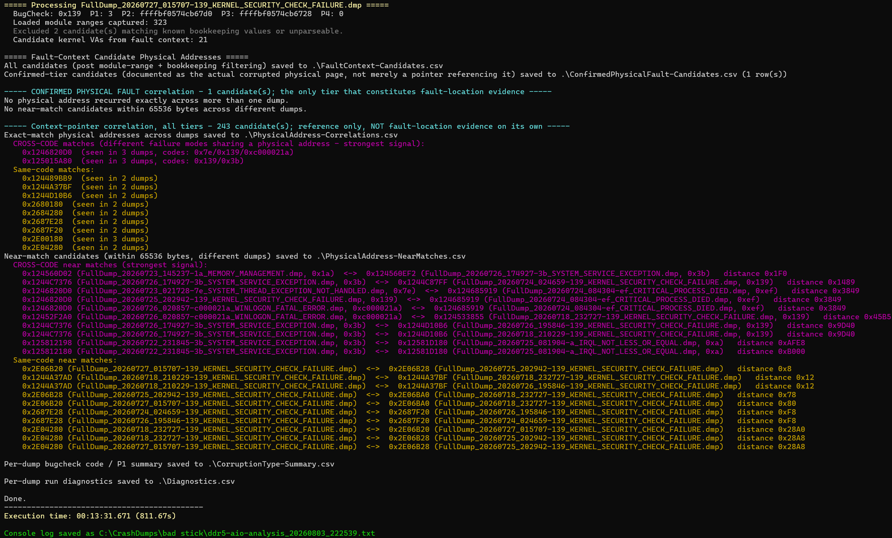
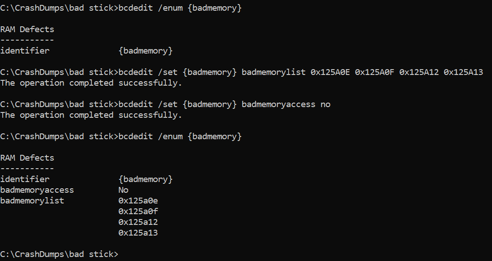
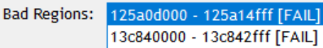
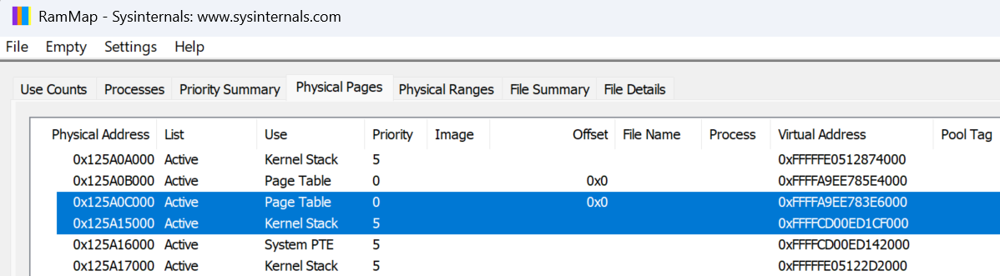
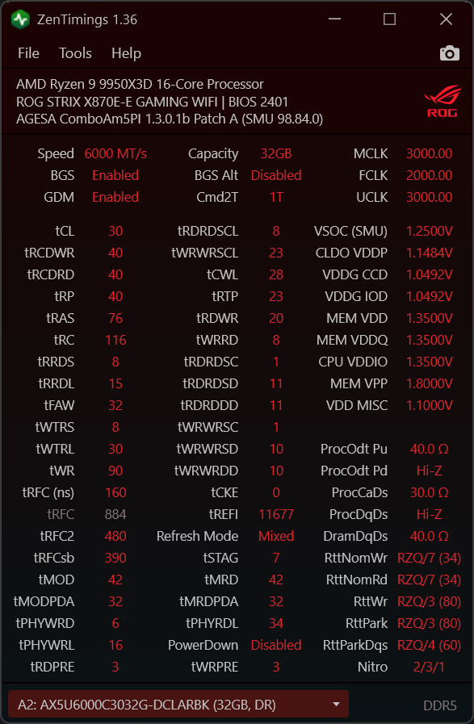

# ddr5-aio-analysis README.md
<a href="https://github.com/ExponentiallyDigital/ddr5-aio-analysis/releases" target="_blank" rel="noopener noreferrer"></a> <a href="https://www.microsoft.com/" target="_blank" rel="noopener noreferrer"></a> <a href="https://github.com/ExponentiallyDigital/ddr5-aio-analysis/blob/main/LICENSE" target="_blank" rel="noopener noreferrer"></a>
<a href="https://github.com/ExponentiallyDigital/cfg-pia-wg/releases" target="_blank" rel="noopener noreferrer"></a> <a href="https://github.com/ExponentiallyDigital/ddr5-aio-analysis" target="_blank" rel="noopener noreferrer"></a> <a href="https://github.com/ExponentiallyDigital/ddr5-aio-analysis/commits/main" target="_blank" rel="noopener noreferrer"></a> <a href="https://github.com/ExponentiallyDigital/ddr5-aio-analysis" target="_blank" rel="noopener noreferrer"></a> <a href="https://github.com/ExponentiallyDigital/ddr5-aio-analysis/commits/main" target="_blank" rel="noopener noreferrer"></a>

> [!TIP]
> **`ddr5-aio-analysis.ps1`** seeks to identify the in-RAM location of physical RAM defects through correlating the location of corrupted RAM from multiple full Windows `memory.dmp` files, translating virtual to physical addresses, and outputting results to the console and CSV files.

- [1. Overview](#1-overview)
- [2. Background: why correlate physical addresses?](#2-background-why-correlate-physical-addresses)
  - [2.1. Key questions](#21-key-questions)
  - [2.2. What can't be ascertained](#22-what-cant-be-ascertained)
  - [2.3. What dump analysis can't rule out](#23-what-dump-analysis-cant-rule-out)
    - [2.3.1. Stuck counter bit (same physical address)](#231-stuck-counter-bit-same-physical-address)
    - [2.3.2. Address line failure (XOR = power of 2)](#232-address-line-failure-xor--power-of-2)
- [3. Prerequisites](#3-prerequisites)
- [4. Set up your environment](#4-set-up-your-environment)
  - [4.1. Memory interleaving](#41-memory-interleaving)
    - [4.1.1. Where to find it in the BIOS](#411-where-to-find-it-in-the-bios)
      - [4.1.1.1. On AMD systems](#4111-on-amd-systems)
      - [4.1.1.2. On Intel systems](#4112-on-intel-systems)
      - [4.1.1.3. Legacy / alternative terms](#4113-legacy--alternative-terms)
  - [4.2. Prevent Windows from overwriting the last crash dump](#42-prevent-windows-from-overwriting-the-last-crash-dump)
    - [4.2.1. PowerShell script: `SetDumpPath.ps1`](#421-powershell-script-setdumppathps1)
    - [4.2.2. Backup your default crash settings (for reference)](#422-backup-your-default-crash-settings-for-reference)
    - [4.2.3. Create a scheduled task - `CrashDumpPathRotation.xml`](#423-create-a-scheduled-task---crashdumppathrotationxml)
    - [4.2.4. Test crash dump creation](#424-test-crash-dump-creation)
- [5. Running the analysis](#5-running-the-analysis)
  - [5.1. Usage](#51-usage)
- [6. Files in this repo](#6-files-in-this-repo)
- [7. How it works](#7-how-it-works)
  - [7.1. Execution logic summary](#71-execution-logic-summary)
  - [7.2. Windows memory management primer](#72-windows-memory-management-primer)
  - [7.3. Key elements of the hierarchy](#73-key-elements-of-the-hierarchy)
- [8. Output files](#8-output-files)
- [9. Sample console output](#9-sample-console-output)
- [10. Interpreting results](#10-interpreting-results)
- [11. Excluding physical memory addresses from use in Windows](#11-excluding-physical-memory-addresses-from-use-in-windows)
  - [11.1. `bcdedit`](#111-bcdedit)
  - [11.2. WHEA registry records](#112-whea-registry-records)
  - [11.3. BadMemory kernel driver](#113-badmemory-kernel-driver)
- [12. How do you know if exclusions are working?](#12-how-do-you-know-if-exclusions-are-working)
  - [12.1. Sysinternals \`livekd'](#121-sysinternals-livekd)
  - [12.2. Sysinternal's `RAMMap`](#122-sysinternals-rammap)
- [13. Addendum - Accelerated crash time](#13-addendum---accelerated-crash-time)
- [14. Addendum - Windows memory patterns](#14-addendum---windows-memory-patterns)
- [15. Bugs and feature requests](#15-bugs-and-feature-requests)
- [16. Donations](#16-donations)
- [17. Support](#17-support)
- [18. License](#18-license)

---

## 1. Overview

This repo exists to answer one narrow question about a suspected faulty DDR5 module: **when Windows crashes, is it always the same physical memory that's involved, or does the corruption move around?** A stuck bit or weak cell should keep landing in roughly the same place across independent crashes; a coincidence, a software bug, or a timing-driven refresh issue that isn't tied to one location generally shouldn't.

`ddr5-aio-analysis.ps1` is a PowerShell script that drives WinDbg's `cdb.exe` non-interactively across a folder of kernel crash dumps, extracts every plausible corrupted-memory address it can find in each crash's fault context, translates those virtual addresses to physical addresses via a real page-table walk, and correlates the results across dumps, both exact matches and near-misses, and separately for crashes that share the same Windows stop code versus crashes that don't.

This document covers the reasoning behind the approach and its limits, how to set your machine up to preserve more than one crash dump, how to run the script, and how to read its output.

## 2. Background: why correlate physical addresses?

My brand new system, using a B850 then X870 mobo, crashed for seven months with what turned out to be a highly predictable uptime of 5 hours and 55 minutes (T2) or 11 hours and 50 minutes (T1). To quote a phrase from the actor Michael Caine, "[use the difficulty](https://www.exponentiallydigital.com/everything-is-difficult-if-you-think-of-it-that-way)": in moments like this we have choices, how we will use the 'difficulty'. So, armed with my prior skills as a Windows 2000/2003 Datacenter certified engineer, I treated this like any other problem I've encountered. Use a rigorous and structured approach to narrow down the root cause, and while doing so learn something. And yes, it took quite some time.

Once the crashes were found to be deterministic, crashing after a set number of RAM refresh events, the trigger turned out to be refresh-count-invariant, meaning that it always happened after the same total number of refresh commands, no matter how the conditions were changed with 'bank refresh mode' or tREFI; changing those settings merely reduced or extended uptime in a linear fashion.

Extensive, long-duration testing ruled out CPU and RAM voltages, primary and secondary timings, operating systems (Windows 11 25H2, Ubuntu 24.04 and 26.05, plus Memtest running extended testing - I installed/reinstalled operating systems eight times!), memory profiles (JEDEC, EXPOI, EXPOII, EXPO "on the fly"), memory retention testing under multiple load types with stress testing (Karhu RAMTest, MemTest86, OCCT, Prime95, TestMem5, y-cruncher, Fur Mark, Typhoon), thermals (HWiNFO), ten BIOS versions, and two motherboards (the B850 with 4 BIOS versions and the X870 with six BIOS versions).

Over the course of those seven months, I ran 80+ tests during which the picture solidified to potentially be an unusual and thankfully (for this audience) rare defect in my RAM.

The RAM in question is ADATA AX5U6000C3032G 2×32 GB, SK Hynix A‑die (4.1), dual‑rank, EXPO 6000 MT/s CL30-40-40-76, does not support RFM, and is motherboard QVL listed.

Once myriad software and hardware set-ups had been ruled out, it turned out that single stick testing of the matched pair showed one stick always caused crashes at T1 or T2.

As an intellectual challenge, I wanted to find, if possible, commonalities across those crashes. On the assumption that Windows stop codes will change depending on which Windows structure is corrupted, and short of physical analysis (with FIB, e-beam, or decapping and visual inspection, to ascertain if the defect is in the refresh counter, the row decoder, or the bank multiplexer), I decided to look for physical address correlations in full Windows memory dump files. Hence this repo, gentle reader, which I'm sharing with you.

### 2.1. Key questions

- Is the corruption **physical-address-dependent**?
- Does corruption occur across boots at the **same physical address** suggesting a stuck data bit or weak cell(s)?
- Is the corruption essentially **random**?

### 2.2. What can't be ascertained

| Mechanism                 | Fault Description                                                                                             | What you'd see in dumps                                                   |
| ------------------------- | ------------------------------------------------------------------------------------------------------------- | ------------------------------------------------------------------------- |
| tRFC violation            | Refresh issued too fast for defective row to recover; happens after N refreshes due to cumulative charge loss | Random physical addresses, no XOR pattern, no duplicate data              |
| Bank group decoder fault  | Refresh targets wrong bank group; happens at fixed refresh count if bank counter is defective                 | Scattered physical addressess, possibly in same bank-group-aligned region |
| Sense amplifier failure   | The sense amp for a specific row/bank fails after N activations                                               | Same row or adjacent rows, but data is garbage not copied                 |
| Word-line stuck-on        | A word-line remains activated, corrupting adjacent rows via charge sharing                                    | Adjacent-row pattern, but not identical data                              |
| On-die ECC scrubber fault | DDR5's ECC scrubber activates at refresh time and writes wrong data                                           | Random pattern, no address correlation                                    |

### 2.3. What dump analysis can't rule out

None of the above or below mechanisms are things this script - or any dump analysis - can definitively distinguish between. What the script _can_ do is tell you whether the same physical page keeps turning up across independent crashes, which narrows the field but does not itself identify which of the mechanisms is responsible. That distinction still requires physical hardware analysis or a controlled exclusion test (see [Interpreting results](#interpreting-results)).

#### 2.3.1. Stuck counter bit (same physical address)

Will be detected if the refresh counter fails refreshing the same row, and that row happens to contain a kernel structure that crashes the system.

Might miss if:

- the counter doesn't get "stuck" but instead overflows and wraps around, hitting different rows on different boots
- the corrupted row contains user data or free memory that doesn't immediately crash, Windows keeps running until a different structure gets hit
- the memory controller's bank interleaving or XOR scrambling spreads the "same row" across multiple physical addresses that aren't identical
- crashes happen because a refresh is skipped (counter jumps), rather than stuck

A refresh counter is typically 13–16 bits (8192–65536 rows). If bit 12 is stuck, you have 2 rows that alternate. If the counter overflows at N≈10.9 billion, it could be wrapping through the entire address space multiple times. The "same PA" pattern is only guaranteed if the counter is truly frozen, not just faulty.

#### 2.3.2. Address line failure (XOR = power of 2)

Will be detected if an internal address line (A0–A16) is stuck-at-0 or stuck-at-1, causing the refresh to consistently target row ^ (1 << N).

Might miss if:

- the address failure is intermittent (thermal/voltage dependent on the decoder, not the cell)
- the failure is in the bank decoder (3 bits) rather than the row decoder, which would produce a different pattern
- the failure is in the column decoder (within-row corruption, not wrong-row)
- DDR5's on-die address scrambling (for Rowhammer mitigation) obfuscates the physical-to-logical mapping

Modern DRAM chips scramble addresses to defeat Rowhammer. The physical row number you compute from the system physical address is not the internal row number the DRAM uses. A stuck bit in the internal row counter might not produce a clean power-of-2 XOR in system physical addresses.

---

## 3. Prerequisites

Before setting up dump collection or running the analysis script, make sure you have:

- **Debugging Tools for Windows (WinDbg)**, specifically `cdb.exe`, installed via the Windows SDK or the standalone WinDbg package. The script's `-CDB` parameter defaults to `C:\Program Files (x86)\Windows Kits\10\Debuggers\x64\cdb.exe`; adjust it if your install path differs.
- **A symbol path** with access to the Microsoft public symbol server (or a local symbol cache), so `!analyze -v` can resolve module and function names. The script's `-SymbolPath` parameter defaults to `srv*C:\Symbols*https://msdl.microsoft.com/download/symbols`.
- **PowerShell 5.1 or later**, run with sufficient privileges to read the dump files and write to your chosen output folder.
- **Administrator rights**, separately, for the crash-dump-path rotation setup below (registry edits and a scheduled task running as SYSTEM).
- **Full kernel memory dumps**, not minidumps, the script relies on `!analyze -v` reliably producing `TRAP_FRAME:`/`CONTEXT:`/`STACK_TEXT:` sections and a full `lm` module list, which minidumps don't reliably retain.

## 4. Set up your environment

### 4.1. Memory interleaving

Ideally, test with only one stick in your system. In hindsight, I wish I'd done that sooner, but if I had, this repo and exploration wouldn't exist. If you use more than one stick, you'll need to disable memory interleaving.This is known by several names across different BIOS systems and motherboards. In a BIOS/UEFI setup, it is typically named based on the specific **hardware layer** being interleaved.

#### 4.1.1. Where to find it in the BIOS

##### 4.1.1.1. On AMD systems

Look under the **AMD CBS** (Core Complex System) menu:

> `Advanced` → `AMD CBS` → `DRAM Controller Configuration` or `Data Fabric Options`

- Common options: **Memory Interleaving**, **Memory Interleaving Size** (e.g., 256B, 512B, 1KB, Auto), or **Channel Interleaving Hash**.

##### 4.1.1.2. On Intel systems

Look under the primary memory or processor configuration settings:

> `Advanced` → `System Agent (SA) Configuration` → `Memory Configuration`

- Common options: **Channel Interleaving**, **IMC Interleaving**, or **Sub-NUMA Clustering (SNC)**.

##### 4.1.1.3. Legacy / alternative terms

- **Ganged / Unganged Mode** _(Older AMD platforms like Phenom II/FX)_:
- **Unganged** = Interleaved (two independent 64-bit channels; better performance).
- **Ganged** = Non-interleaved (one combined 128-bit channel).

### 4.2. Prevent Windows from overwriting the last crash dump

See [files in this repo](#6-files-in-this-repo) for examples that help replicate the below set-up steps.

By design, Windows always overwrites the last crash dump file and has no native method of preventing this. The only practical solution is to dynamically change the dump filename on every boot.

#### 4.2.1. PowerShell script: `SetDumpPath.ps1`

```powershell
# This script ensures the dump directory exists and sets a unique filename so Windows will not overwrite the dump
$DumpRoot = "C:\CrashDumps"

# Ensure directory exists
if (!(Test-Path $DumpRoot)) {
    New-Item -ItemType Directory -Path $DumpRoot| Out-Null
}

# Generate unique filename
$Timestamp = (Get-Date).ToString("yyyyMMdd_HHmmss")
$DumpFile = "$DumpRoot\FullDump_$Timestamp.dmp"

# CrashControl registry path
$RegPath = "HKLM:\SYSTEM\CurrentControlSet\Control\CrashControl"

# Ensure full dump mode
Set-ItemProperty -Path $RegPath -Name "CrashDumpEnabled" -Value 1

# Set dump filename
Set-ItemProperty -Path $RegPath -Name "DumpFile" -Value $DumpFile
```

#### 4.2.2. Backup your default crash settings (for reference)

Backup your existing registry crash setting, which will look something like the below, here the "DumpFile" entry in hex translates to `%SystemRoot%\MEMORY.DMP`.

```reg
Windows Registry Editor Version 5.00

[HKEY_LOCAL_MACHINE\SYSTEM\CurrentControlSet\Control\CrashControl]
"AutoReboot"=dword:00000001
"CrashDumpEnabled"=dword:00000001
"DumpFile"=hex(2):25,00,53,00,79,00,73,00,74,00,65,00,6d,00,52,00,6f,00,6f,00,\
  74,00,25,00,5c,00,4d,00,45,00,4d,00,4f,00,52,00,59,00,2e,00,44,00,4d,00,50,\
  00,00,00
"DumpLogLevel"=dword:00000000
"EnableLogFile"=dword:00000001
"LogEvent"=dword:00000001
"MinidumpDir"=hex(2):25,00,53,00,79,00,73,00,74,00,65,00,6d,00,52,00,6f,00,6f,\
  00,74,00,25,00,5c,00,4d,00,69,00,6e,00,69,00,64,00,75,00,6d,00,70,00,00,00
"MinidumpsCount"=dword:00000005
"Overwrite"=dword:00000001
"DumpFilters"=hex(7):64,00,75,00,6d,00,70,00,66,00,76,00,65,00,2e,00,73,00,79,\
  00,73,00,00,00,00,00
"AlwaysKeepMemoryDump"=dword:00000000
```

#### 4.2.3. Create a scheduled task - `CrashDumpPathRotation.xml`

Scheduled a task to run `SetDumpPath.ps1` at boot, this enables collection of multiple dump files. Alter the path below according to where you put the `SetDumpPath.ps1` script.

Create a new task (not a Basic Task) with the following settings:

**General tab:**

- Name: `CrashDumpPathRotation`
- Security options:
  - Run whether user is logged on or not
  - Run with highest privileges
  - User account: **SYSTEM**

**Triggers tab:**

- New Trigger → **At startup** → Enabled

**Actions tab:**

- Program/script: `powershell.exe`
- Arguments:

  ```text
  -ExecutionPolicy Bypass -File "C:\path-to-somewhere-permanent\SetDumpPath.ps1"
  ```

**Conditions tab:**

- Disable all conditions

**Settings tab:**

- Allow task to be run on demand
- Run task as soon as possible after a scheduled start is missed
- Restart task every 1 minute if it fails, up to 3 times

Run the task manually to verify it works.

#### 4.2.4. Test crash dump creation

For USB keyboards use

```reg
Windows Registry Editor Version 5.00

[HKEY_LOCAL_MACHINE\SYSTEM\CurrentControlSet\Services\kbdhid\Parameters]
"CrashOnCtrlScroll"=dword:00000001
```

Reboot, and ideally exit all apps as the system will immediatly crash(!) when you hold down **Right Ctrl** then tap **Scroll Lock** twice.

---

## 5. Running the analysis

Once you have a folder of full kernel dumps collected using the rotation setup above, `ddr5-aio-analysis.ps1` processes them all in one pass.

**5.1. Supported stop codes**  
The script recognises eight Windows stop codes. Each one reaches KeBugCheckEx differently, so each is handled with a method matched to what that specific bugcheck actually gives you as not every code produces a TRAP_FRAME:/CONTEXT: register block, and not every documented argument is safe to treat as an address.

| | | | |  
|:-:|:-:|-|-|  
| **Stop code** | **Tier** | **How the PA is obtained** | **Is this address confirmed corrupted by Windows?** |
| **`0x1a`** <br>(subtype 0x41790)  | ConfirmedPhysicalFault | Computed directly: `(Arg2 − MmPfnDatabase) / sizeof(_MMPFN)` gives the PFN; no `!pte walk` involved | MEMORY_MANAGEMENT<br>**Yes.** Microsoft's documentation identifies Arg2 as the PFN-database entry for the corrupted page itself. Only subtype 0x41790 is handled: the true corrupted PFN is computed as `(Arg2 - MmPfnDatabase) / sizeof(_MMPFN)`, not read via `!pte`.<br>No register block (usually). |
| **`0x7e`** | FaultTargetAddress | Parsed from `!analyze -v`'s own `"Attempt to read/write/execute from address X"` line, then `!pte`-translated | SYSTEM_THREAD_EXCEPTION_NOT_HANDLED<br>_**Partially**_. Windows computed and reported this exact address, but it's the address a faulting pointer _**referenced**_, not necessarily proof that page is itself defective; the corruption could instead be in the pointer's own storage location.<br>P1–P4 excluded. Register block `CONTEXT:` |
| **`0xa`** | FaultTargetAddress | Arg1 ("memory referenced"), !pte-translated | IRQL_NOT_LESS_OR_EQUAL<br>_**Same caveat as 0x7e**_ - documented and explicit, but identifies the target of the access, not a confirmed defect. Arg1 ("memory referenced") added as a candidate;<br>P1–P4 excluded as bookkeeping. Register block `TRAP_FRAME:` |
| **`0x3b`** | ContextPointer | Generic scan of `CONTEXT:` registers and `STACK_TEXT` arguments, each `!pte`-translated | SYSTEM_SERVICE_EXCEPTION<br>No. This bugcheck has no separate exception record with a memory-address parameter: everything here is inferred from what's nearby, not reported by Windows.<br>P1–P4 excluded. Register block `CONTEXT:` |
| **`0x139`** | ContextPointer | Same generic scan `(TRAP_FRAME: + STACK_TEXT)` | KERNEL_SECURITY_CHECK_FAILURE<br>No. FAST_FAIL_CORRUPT_LIST_ENTRY only reports the **_type_** of corruption (e.g. double-remove), never a location. P1–P4 excluded (debugger self-reference addresses).<br>Register block `TRAP_FRAME:` |
| **`0xef`** | ContextPointer | Arg1/Arg3 (documented process/thread object), `!pte`-translated | CRITICAL_PROCESS_DIED<br>No. Windows confirms **_which object_** was involved, not that any specific memory address is corrupted. Arg1/Arg3 (process or thread object) added as candidates.<br>No register block. |
| **`0xc000021a`** | ContextPointer | Arg1 (documented pointer to a diagnostic string), `!pte`-translated | WINLOGON_FATAL_ERROR<br>No, same reasoning as 0xef: a real, documented pointer, but to an object, not a fault location. Arg1 (string pointer) added as a candidate; Arg2 (a sign-extended NTSTATUS) is explicitly excluded since it coincidentally matches the canonical-kernel-address pattern; Arg3/Arg4 are typically user-mode addresses and out of scope.<br>No register block. |
| **`0x18b`** | ContextPointer<br>(low-confidence) | Generic `STACK_TEXT` scan only | SECURE_KERNEL_ERROR<br>No. Arguments aren't documented by Microsoft at all here; everything is inference. Arguments are not officially documented by Microsoft; candidates come from `STACK_TEXT` only and are tagged low-confidence.<br>No register block. |

**Caveat**: only the ConfirmedPhysicalFault row in the tool's csv output is authoritative in the sense of "Windows itself says this page is corrupted." Everything else is either "Windows told us what was touched" (FaultTargetAddress) or "we found this value nearby and it survived filtering" (ContextPointer), useful for pattern-spotting across many dumps, but not evidence on its own.

### 5.1. Usage

```powershell
.\ddr5-aio-analysis.ps1 `
    [-DumpFolder "C:\CrashDumps"] `
    [-OutputFolder "C:\CrashDumps\Analysis"] `
    [-ProximityThresholdBytes 0x1000] `
    [-VerboseOnTimeout] `
    [-NoClearScreen]
```

- `-CDB` and `-SymbolPath` only need overriding if your WinDbg install isn't in your path or your symbol cache lives somewhere other than the default described in [Prerequisites](#prerequisites).
- `-ProximityThresholdBytes` controls how close two physical addresses from different dumps have to be to count as a near-match (default `0x10000`; tighten this as your dump count grows, since a wide threshold on a large dump set produces a lot of coincidental pairings; see [Interpreting results](#interpreting-results)).
- `-VerboseOnTimeout` displays all raw output from `cdb.exe` for use in situations where cdb execution exceeds 240s.
- `-NoClearScreen` the console screen is cleared at startup unless this parameter is supplied, this allows the final step of the program which does a copy/paste of the whole console to a text file in the current directory eg `ddr5-aio-analysis_20260727_154752.txt`.

If required parameters are not supplied, they are prompted for.

When running analysis for the first time or with stop codes that haven't appeared before, it's a good idea to allow symbol files to download and cache by first opening the dump in the GUI WinDebug. Some dump types can require a very large quanity of weighty symbol files. Once cached, this script is unlikely to time out. I currently have +600 MB used by the symbol cache.

---

## 6. Files in this repo

```text
ddr5-aio-analysis
|  ddr5-aio-analysis.ps1           # analysis and reporting script
|  LICENSE                         # license
|  README.md                       # this document
|   
+--sample-exclusions
|    exclude-one_address.reg       # sample reg entry to exclude addresses
|    exclude-eleven_addresses.reg  # sample reg entry to exclude addresses
|       
\--sample-setup-tools
     add-exclusions.ps1            # scripted addition of exclusions
     show-exclusions.ps1           # displays currently active exclusions
     delete-all-exclusions.reg     # deletes all exclusions, reboot to activate

     CrashDumpPathRotationTask.xml # sample Task Scheduler task (edit 1st)
     SetDumpPath.ps1               # set the dump path & file name at boot
     crash_on_ctl_scroll.reg       # enable MANUALLY_INITIATED_CRASH (e2)

     crash_dump_default.reg        # default dump to %SYSTEMROOT%\MEMORY.dmp
     crash_dump_timestamped.reg    # example of having run SetDumpPath
```

## 7. How it works



Yes, that's a lot of information in a small diagram, but you _can_ zoom in :)!

### 7.1. Execution logic summary

1. for each dump
2. `!analyze -v` and `lm` are captured
3. the `bugcheck code` is checked against the supported list
4. whatever `register/stack` data is available for that `specific code` is extracted, and code-specific candidates are added or excluded
5. every surviving `virtual address` (VA) is translated to a `physical address` (PA) via a `!pte` leaf-PFN walk (translating the VA to its exact physical RAM frame by reading the bottom-level Page Table Entry (PTE) in the hierarchy)
6. candidates that land inside a loaded module's `code/data` range are discarded, and everything that's left is carried into the cross-dump correlation step once every dump has been processed

If that's confusing, the next section _may_ help...

### 7.2. Windows memory management primer

A **Virtual Address (VA)** sits at the highest level in this hierarchy as a software abstraction. Applications and the OS use VAs so they can work with a clean, continuous block of memory without needing to worry about where that data actually lives in physical hardware.

When the CPU needs to access a VA, it translates it by stepping down a multi-level paging tree:

1. **Control Register 3** (CR3), the CPU register holding the root pointer to PML4 →
2. **Page Map Level 4** (PML4), top-level table pointing to the PDPT →
3. **Page Directory Pointer Table** (PDPT), directory table pointing to the PD →
4. **Page Directory** (PD), directory table pointing to the PT →
5. **Page Table** (PT), bottom-level table containing the leaf PTEs.

Each level acts like a progressively narrower filter, much like decoding a mailing address from Country, to State, to City, to Street, with the house number representing a PTE. This guides the CPU to its destination.

- **Top of the tree:** the process begins at **Control Register 3 (CR3)**, a CPU hardware register storing the physical base address of the process's root page table (**PML4**)

- **Bottom of the tree:** the **Page Table (PT)** is the fifth and final structure. Inside this bottom-level table sits the **Page Table Entry (PTE)**, which holds the final translation mapping

Inside a PTE is the **Page Frame Number (PFN)**. This is a physical index pointing to the exact fixed-size (4KB) frame in RAM where the data lives. By combining that PFN with the original byte offset from the Virtual Address, the CPU arrives at the precise **Physical Address (PA)**, pinpointing the actual hardware location on the DIMM.

Diagramatically, the full hierarchy is:



### 7.3. Key elements of the hierarchy

- `PML4, PDPT, PD, PT`: the multi-level tables the CPU walks through.
- `Page Table` (the 'bottom'): this is the level 1 table, the absolute last table the CPU accesses in the walk.
- `PTE` (Page Table Entry): this is the single, individual entry inside that bottom-level Page Table. The entire process of 'walking' the tree exists solely to find this specific entry.
- `PFN` (Page Frame Number): this crucial index is extracted from the PTE. It tells the system, "Your data is in Physical RAM Frame number 0x1A2B."

## 8. Output files

The script writes four CSVs to `-OutputFolder`:

- **`FaultContext-Candidates.csv`** every surviving candidate from every dump: dump name, stop code, the code's first bugcheck argument (`CorruptionType`), the original virtual address, the translated physical address, and a `Note` field used for anything that needs extra context (e.g. a computed-rather-than-translated 0x1a address, or a low-confidence 0x18b tag).
- **`PhysicalAddress-Correlations.csv`** physical addresses that match _exactly_ across two or more dumps, tagged `SameCode` (all matching dumps share one stop code) or `CrossCode` (different stop codes landed on the same physical page which is the stronger of the two, since there's no structural reason unrelated failure modes should share a physical address unless something there is actually bad).
- **`PhysicalAddress-NearMatches.csv`** pairs of physical addresses from different dumps within `-ProximityThresholdBytes` of each other but not identical, similarly tagged `SameCode`/`CrossCode`.
- **`CorruptionType-Summary.csv`** one row per dump, showing its stop code and first bugcheck argument, useful for spotting whether the same corruption subtype (e.g. `0x139` Arg1 = `3`, a LIST_ENTRY double-remove) recurs across otherwise-unrelated crashes.

---

## 9. Sample console output

<p align="center">
  
  <br>
  Sample console output
</p>
<br>
<p align="center">
  
  <br>
  Sample console output
</p>

---

## 10. Interpreting results

A `CrossCode` match in `PhysicalAddress-Correlations.csv` is the single strongest signal that `ddr5-aio-analysis.ps1` can produce, precisely because it doesn't depend on any theory about _why_ two crashes would share a location: an `access violation` and a `LIST_ENTRY` corruption have no structural reason to land on the same physical page unless something at that page is actually implicated. A `SameCode` match is weaker, since it has a mundane alternative explanation: similar allocator behaviour, similar call paths, or similar stack layout across similar crashes can produce a shared address with nothing wrong with the hardware at all.

Neither kind of match is proof by itself. Before trusting any specific physical address enough to act on it, for example excluding it from Windows via a bad-memory list, see [Excluding physical memory addresses from Windows use](#excluding-physical-memory-addresses-from-windows-use), it's worth checking what's actually supposed to be at that address: `!pfn`, `!pool`, or `!thread` against the physical/virtual address in question will tell you whether it's a legitimate, mundane kernel object (which doesn't rule out a hardware fault, but removes one alternative explanation) or something that looks genuinely inconsistent. Re-read the [caveats](#caveats-what-dump-analysis-cannot-rule-out) section above before drawing a firm conclusion either way: this script can tell you _that_ a physical address recurs, not _which_ of the underlying DRAM failure mechanisms would explain it, or rule out that the recurrence is coincidental.

---

## 11. Excluding physical memory addresses from use in Windows

There are three ways to do this:

1. `bcdedit` (the Boot Configuration Data Store Editor) which allows you to set boot time options. These parameters are passed to the kernel on boot, much like Linux, and take effect very early in the boot process. These records are written to a binary file which functions as a Windows registry hive. Its exact location depends on your system's firmware:

    - **For BIOS (Legacy/MBR) systems**: the file is located in the `\Boot` directory of the **active partition**.
      - **Full path**: `\Boot\BCD`

    - **For UEFI (EFI/GPT) systems**: the file is located on the **EFI System Partition (ESP)**.
      - **Full path**: `\EFI\Microsoft\Boot\BCD`

    During operation, Windows mounts the `BCD` file to the registry hive `HKLM\BCD00000000`.
2. Enterprise/server class systems with ECC RAM use WHEA records that are populated automagically by firmware when errors are detected. These records are written to the registry. However, these load late in the Windows startup sequence.
3. The [BadMemory kernel mode driver](https://github.com/prsyahmi/BadMemory) on GitHub.

### 11.1. `bcdedit`

As at 2026-07, there was scant information online to confirm that `bcdedit` still supports memory exclusion. Several Microsoft web pages didn't list the full command structure, and those that did didn't mention any PA address exclusion capability.

To add exclusions use:

```cmd
  bcdedit /set {badmemory} badmemoryaccess no
  bcdedit /set {badmemory} badmemorylist 0x125A0D 0x125A0E 0x125A0F 0x125A10 0x125A11 0x125A12 0x125A13 0x125A14 0x13C840 0x13C841 0x13C842
  (reboot)
```

To delete all exclusions:

```cmd
  bcdedit /deletevalue {badmemory} badmemorylist
  bcdedit /deletevalue {badmemory} badmemoryaccess
  (reboot)
```

Display exclusions:

```cmd
  bcdedit /enum {badmemory}
```

Here's what that looks like in use:

<p align="center">
  
  <br>
  bcdedit exclusions
</p>

### 11.2. WHEA registry records

I can't speak to this as my system doesn't support OS hardware error correction reporting. If you load memory address exclusions into the WHEA registry hive they may be used or silently ignored, depending on your hardware.

### 11.3. BadMemory kernel driver

This repo is ten years old, and while the repo owner did respond to a GitHub issue, and incredibly quickly too, you do have to jump through some hoops getting it correctly installed:

  1. in your BIOS, disable `secure boot` - on my system I did this by setting `OS=other`
  2. then, as an administrator run `bcdedit /set loadoptions DISABLE_INTEGRITY_CHECKS`
  3. and again, as an administrator run `bcdedit /set testsigning on`
  4. reboot

What are the practical implications of disabling `secure boot` and enabling unsigned kernel driver loading? Loading a 10 year old kernel mode driver might cause some concern. While that's probably OK for testing purposes, I'm not sure that it's a good idea as a long term strategy as it may materially increase your 'attack' surface.

It does however have a GUI for entering/checking that exclusions are working (stored in the registry):

<p align="center">
  
  <br>
  Exclusions
</p>

I was testing with `bcdedit` and WHEA at the same time as this screenshot, which is why the exclusions are showing here as `FAIL`, I believe, but see the waning in [12.1. Sysinternals \`livekd'](#121-sysinternals-livekd).

## 12. How do you know if exclusions are working?

Whichever tool you use I suggest including a 1 page (4KB) buffer before and after each exclusion.

```text
Cluster 1
 - 0x125A0D → Buffer (1 page before)
 - 0x125A0E → Bad
 - 0x125A0F → Bad
 - 0x125A10 → buffer between bad pages
 - 0x125A11 → buffer between bad pages
 - 0x125A12 → Bad
 - 0x125A13 → Bad
 - 0x125A14 → Buffer (1 page after)
Cluster 2
 - 0x13C840 → Buffer (1 page before)
 - 0x13C841 → Bad
 - 0x13C842 → Buffer (1 page after)
```

The above 11 addresses consitute 44 KB of total "lost" RAM, which isn't much on a 65GB system!

### 12.1. Sysinternals `livekd'

The fabulous folks at [Sysinternals](https://learn.microsoft.com/en-us/sysinternals/) developed [`livekd64.exe`](https://learn.microsoft.com/en-us/sysinternals/downloads/livekd). This tool allows you to attach to a running system and query live memory structures, as if you were accessing a dump file. Be careful what you do it with!

In the below I tried to read the contents of one of the memory ranges I'd blacklisted with `!dq /p 125A140FF` and it correctly returned an access error:

```console
0: kd> !dq /p 125A140FF
Physical memory read at 0 failed
If you know the caching attributes used for the memory,
try specifying [c], [uc] or [wc], as in !dd [c] <params>.
WARNING: Incorrect use of these flags will cause unpredictable
processor corruption.  This may immediately (or at any time in
the future until reboot) result in a system hang, incorrect data
being displayed or other strange crashes and corruption.
```

Using the same memory address, after removing the exclusion and rebooting, the `dq /p 125A140FF` command shows that `livekd64.exe` couldn't display the contents of that address (question marks are returned):

```console
0: kd> dq /p 125A140FF L2
00000001`25a140ff  ????????`???????? ????????`????????
00000001`25a1410f  ????????`???????? ????????`????????
00000001`25a1411f  ????????`???????? ????????`????????
00000001`25a1412f  ????????`???????? ????????`????????
00000001`25a1413f  ????????`???????? ????????`????????
00000001`25a1414f  ????????`???????? ????????`????????
00000001`25a1415f  ????????`???????? ????????`????????
00000001`25a1416f  ????????`???????? ????????`????????
```

> [!WARNING]
> What's the difference between `!dq /p` and `dq /p`? They run the in-built command or an extension. I noticed while writing this up that I'd used different commands :/. It's possible I did a bad copy and paste to my journal or maybe I did use different commands, so you'd need to verify this yourself. When I ran them I did have all three memory exclusion methods running: WHEA registry entries, `bcdedit`, and the BadMemory kernel driver. I do know that the BadMemory driver, see screenshot above, showed a FAIL for the memory range which I assumed was caused by a precidence issue in that one of the other two methods had alreday disabled access to that region. But this needs to be revalidated.

### 12.2. Sysinternal's `RAMMap`

Another [Sysinternals](https://learn.microsoft.com/en-us/sysinternals/) tool, `RAMMap64.exe` gives you detailed information about Windows' memory use. It includes display of "bad" memory, memory locked out by WHEA records (if your hardware supports this). If not you can, however, use this to see what/who is allocated to specific memory ranges, that requires a lot of scrolling around to find the right on-screen location, but does give you the require information.

<p align="center">
  
  <br>
  SysInternals RAMMap
</p>

---

## 13. Addendum - Accelerated crash time

For my specific environment, I can vary T1/T2 since uptime scales with tREFI. This saves having to wait many, many days to get a usable sample of dump files for analysis. A crash time of ~5h 55m (T2) occurs repeatably with optimised BIOS defaults which sets `bank refresh mode = auto`, and EXPOII which sets `tREFI = 11,677`, optimised BIOS defaults also sets `bank refresh mode` to `mixed`:

<p align="center">
  
  <br>
  ZenTimings - EXPOII stock
</p>

Based on the observed linearity of crash timing when tREFI is manually set, we can deduce an actual crash time, and when paired with an observed crash time at that setting, this gives us:

| tREFI setting | tREFI % change from auto | Expected crash time | Actual crash time | difference (expected vs actual) |
| :-----------: | :----------------------: | :-----------------: | :---------------: | :-----------------------------: |
|    23,354     |           100%           |      23:40:17       |     23:38:36      |             -0.12%              |
|    16,348     |           50%            |      16:34:13       |     16:33:02      |             -0.12%              |
|    14,597     |           25%            |      14:47:44       |     14:46:41      |             -0.12%              |
|    11,677     |        0% (auto)         |      11:50:09       |     11:49:16      |             -0.12%              |
|     8,758     |           -25%           |      08:52:37       |     08:51:56      |             -0.13%              |
|     5,839     |           -50%           |      05:55:06       |     05:54:30      |             -0.17%              |
|     3,900     |          -66.6%          |      03:57:11       |     01:58:11      |             -50.08%             |

**NB** all the above values, except the `tREFI=3,900` row were obtained from test runs with `bank refresh mode = normal` which doubles uptime from `bank refresh mode = auto (mixed)` (the BIOS default when set to `auto`). The **actual crash time** for `tREFI=3,900` was obtained from 3 runs with `bank refresh mode = auto (mixed)`, resulting in these values:

<p align="center">
  
  <br>
  ZenTimings - low tREFI
</p>

I tried 3,900 as a starting point for accelereted dump generation, which is -66.6% of the default. However, observed uptime from three test runs only averaged 1:58:32.442. It did though generate three dump files with `KERNEL_SECURITY_CHECK_FAILURE (139)` stop codes with one of the three dumps corrupted (dump failed with error code 0x0, completion of 95%). It also broke the linearity model showing a 50% difference between expected and observed, probably due to command bus saturation from the sheer volume of refresh events occuring. So, time to revert back to default `tREFI` which gives uptime of T2 (5h 55m), this is _bearable_ with ~4 dump files generated per day.

## 14. Addendum - Windows memory patterns

For completeness, Windows has debug “magic numbers” (fill patterns) used by the C runtime (CRT) debug heap, the Windows heap manager, kernel pool allocator, and compiler runtime checks. They make memory corruption, use-after-free, and uninitialized-variable bugs easier to find in a debugger.

However, they only exist in debug builds linked against the debug CRT and not in retail/release versions of Windows. Some doumentation refers to them as active when page-heap or Application Verifier is enabled. See [CRT debug heap details (Microsoft Learn)](https://learn.microsoft.com/en-us/cpp/c-runtime-library/crt-debug-heap-details).

| Pattern    | Description                          | Context                                                                                                            |
| ---------- | ------------------------------------ | ------------------------------------------------------------------------------------------------------------------ |
| 0xDEADBEEF | Freed memory / bad memory marker     | General freed memory indicator                                                                                     |
| 0xBAADF00D | Uninitialized local variables        | Microsoft debug heap (user-mode), seen after `HeapAlloc` / `LocalAlloc` before the application writes to the block |
| 0xFEEDF00D | Freed heap memory                    | Heap allocator marker                                                                                              |
| 0xDEADC0DE | Freed memory marker                  | Alternative freed memory indicator                                                                                 |
| 0xCCCCCCCC | Uninitialized stack memory           | Visual Studio/RTC compiler option, `0xCC` is also the INT 3 breakpoint instruction                                 |
| 0xCDCDCDCD | Uninitialized heap memory            | “clean” allocated memory but never written by the app                                                              |
| 0xDDDDDDDD | Freed heap memory                    | CRT heap, “dead” memory which helps catch writes through dangling pointers                                         |
| 0xFDFDFDFD | Guard bytes after heap blocks        | Heap no-man's-land, 4-byte buffers placed before and after the user’s allocation to catch buffer over/underruns    |
| 0xFEEEFEEE | Freed pool marker                    | Freed memory still in pool, seen after `HeapFree` / `LocalFree` when a debugger is attached                        |
| 0xABABABAB | Kernel pool memory after free        | Windows kernel pool allocator, often appears as trailing guard or free-pool marker                                 |
| 0xA5A5A5A5 | Heap slack space / alignment padding | Heap allocator padding, fills unused bytes between the requested size and the actual rounded-up allocation size    |

---

## 15. Bugs and feature requests

Found a bug or want to request a feature? [Open an issue here](https://github.com/ExponentiallyDigital/ddr5-aio-analysis/issues).

---

## 16. Donations

Kindly consider a [PayPal](https://www.paypal.com/donate/?hosted_button_id=QJYPGRLG2RPBS) or [Patreon](https://www.patreon.com/cw/ExponentiallyDigital) donation to help support development.

---

## 17. Support

This tool is unsupported and may cause objects in mirrors to be closer than they appear. Batteries not included.

---

## 18. License

This program is free software: you can redistribute it and/or modify it under the terms of the GNU General Public License as published by the Free Software Foundation, either version 3 of the License, or (at your option) any later version.

This program is distributed in the hope that it will be useful, but WITHOUT ANY WARRANTY; without even the implied warranty of MERCHANTABILITY or FITNESS FOR A PARTICULAR PURPOSE. See the GNU General Public License for more details.

You should have received a copy of the GNU General Public License along with this program. If not, see <https://www.gnu.org/licenses/>.

Copyright (C) 2026 Andrew Newbury.
