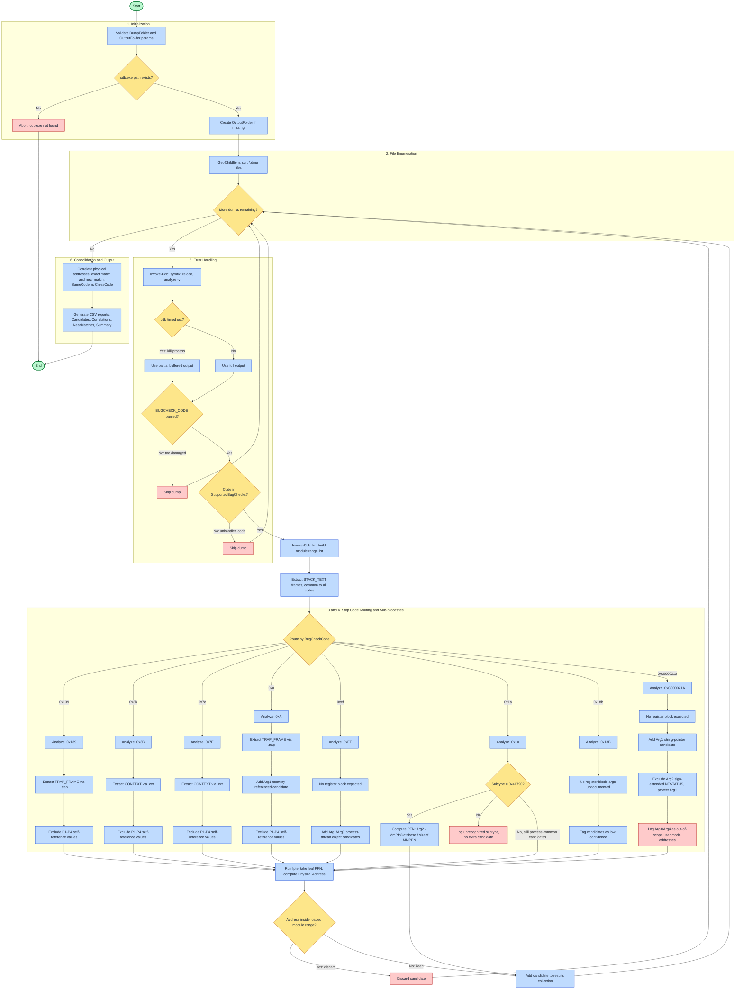
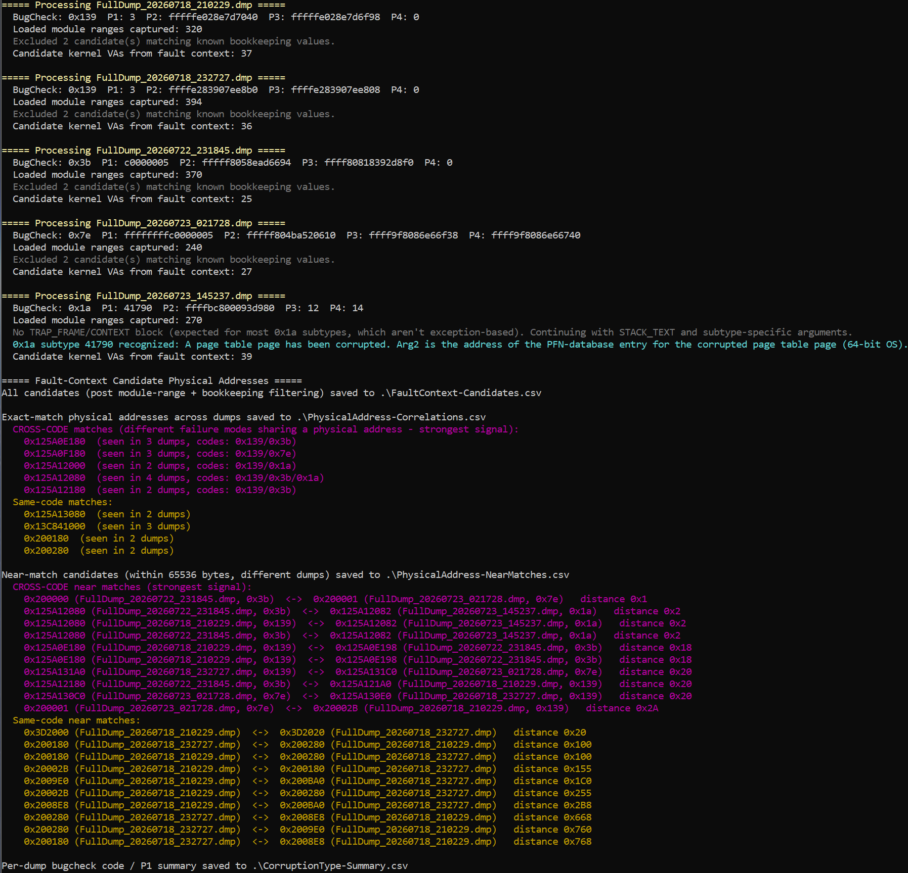

# ddr5-aio-analysis.md

- [ddr5-aio-analysis.md](#ddr5-aio-analysismd)
  - [Overview](#overview)
  - [Background: why correlate physical addresses](#background-why-correlate-physical-addresses)
    - [Key questions](#key-questions)
    - [What we can't ascertain](#what-we-cant-ascertain)
    - [Caveats: what dump analysis cannot rule out](#caveats-what-dump-analysis-cannot-rule-out)
    - [Memory interleaving](#memory-interleaving)
      - [Where to find it in the BIOS](#where-to-find-it-in-the-bios)
        - [On AMD systems](#on-amd-systems)
        - [On Intel systems](#on-intel-systems)
        - [Legacy / alternative terms](#legacy--alternative-terms)
  - [Prerequisites](#prerequisites)
  - [Set up your environment](#set-up-your-environment)
    - [Prevent Windows from overwriting the last crash dump](#prevent-windows-from-overwriting-the-last-crash-dump)
      - [1. PowerShell script: `SetDumpPath.ps1`](#1-powershell-script-setdumppathps1)
      - [2. Backup your default crash settings (for reference)](#2-backup-your-default-crash-settings-for-reference)
      - [3. Create scheduled task (`CrashDumpPathRotation`)](#3-create-scheduled-task-crashdumppathrotation)
      - [4. Test crash dump creation](#4-test-crash-dump-creation)
  - [Running the analysis](#running-the-analysis)
    - [Supported stop codes](#supported-stop-codes)
    - [Usage](#usage)
    - [How it works](#how-it-works)
    - [Output files](#output-files)
  - [Sample output](#sample-output)
  - [Interpreting results](#interpreting-results)
  - [Files in this repo](#files-in-this-repo)

---

## Overview

This repo exists to answer one narrow question about a suspected faulty DDR5 module: **when Windows crashes, is it always the same physical memory that's involved, or does the corruption move around?** A stuck bit or weak cell should keep landing in roughly the same place across independent crashes; a coincidence, a software bug, or a timing-driven refresh issue that isn't tied to one location generally shouldn't.

`ddr5-aio-analysis.ps1` is a PowerShell script that drives WinDbg's `cdb.exe` non-interactively across a folder of kernel crash dumps, extracts every plausible corrupted-memory address it can find in each crash's fault context, translates those virtual addresses to physical addresses via a real page-table walk, and correlates the results across dumps — both exact matches and near-misses, and separately for crashes that share the same Windows stop code versus crashes that don't.

This document covers the reasoning behind the approach and its limits, how to set your machine up to preserve more than one crash dump, how to run the script, and how to read its output.

## Background: why correlate physical addresses?

Why did this repo get created? My X870E-E system from new crashes with what turns out to be a highly predictable uptime of 5 hours and 55 minutes (T2) or 11 hours and 50 minutes (T1).

Crashes are deterministic, crashing after a set number of RAM refresh events have occurred and the trigger is refresh-count-invariant, meaning that it always happens after the same total number of refresh commands, no matter how the conditions are changed with 'bank refresh mode' or tREFI, changing those settings merely reduces or extends uptime in a linear fashion.

Extensive, documented testing ruled out CPU and RAM voltages, primary and secondary timings, operating system (Windows 11 25H2, Ubuntu 24.04 and 26.05, plus Memtest running extended testing), memory profiles (JEDEC, EXPOI, EXPOII, EXPO "on the fly"), memory retention testing under multiple load types with stress testing (Karhu RAMTest, MemTest86, OCCT, Prime95, TestMem5, y-cruncher, Fur Mark, Typhoon), thermals (HWiNFO), ten BIOS versions, and two motherboards (B850 with 4 BIOS versions and X870 with six BIOS versions).

Over the course of seven months I ran 80+ tests during which the picture solidified to potentially be an extremely unusual and rare defect in my RAM.

The RAM in question is ADATA AX5U6000C3032G 2×32 GB, SK Hynix A‑die (4.1), dual‑rank, EXPO 6000 MT/s CL30-40-40-76, does not support RFM, and is motherboard QVL listed.

Single stick testing of the matched pair showed one stick always crashes at T1 or T2. 

As an intellectual challenge I wanted to find, if possible, commonalities between crashes. On the assumption that Windows stop codes will change depending on which Windows structure is corrupted, and short of physical analysis (with FIB, e-beam, or decapping and visual inspection, to ascertain if the defect is in the refresh counter, the row decoder, or the bank multiplexer), we can look for physical address correlations in full Windows dump files.

### Key questions

- Is the corruption **physical-address-dependent**?
- Does corruption occur across boots at the **same physical address** suggesting a stuck data bit or weak cell(s)?
- Is the corruption essentially **random**?

### What we can't ascertain

| Mechanism                 | Fault Description                                                                                             | What you'd see in dumps                                                   |
| ------------------------- | ------------------------------------------------------------------------------------------------------------- | ------------------------------------------------------------------------- |
| tRFC violation            | Refresh issued too fast for defective row to recover; happens after N refreshes due to cumulative charge loss | Random physical addresses, no XOR pattern, no duplicate data              |
| Bank group decoder fault  | Refresh targets wrong bank group; happens at fixed refresh count if bank counter is defective                 | Scattered physical addressess, possibly in same bank-group-aligned region |
| Sense amplifier failure   | The sense amp for a specific row/bank fails after N activations                                               | Same row or adjacent rows, but data is garbage not copied                 |
| Word-line stuck-on        | A word-line remains activated, corrupting adjacent rows via charge sharing                                    | Adjacent-row pattern, but not identical data                              |
| On-die ECC scrubber fault | DDR5's ECC scrubber activates at refresh time and writes wrong data                                           | Random pattern, no address correlation                                    |

### Caveats: what dump analysis cannot rule out

None of the above or below mechanisms are things this script - or any dump analysis - can definitively distinguish between. What the script *can* do is tell you whether the same physical page keeps turning up across independent crashes, which narrows the field but does not itself identify which of the mechanisms is responsible. That distinction still requires physical hardware analysis or a controlled exclusion test (see [Interpreting results](#interpreting-results)).

#### Stuck counter bit (same physical address)

Will be detected if the refresh counter fails refreshing the same row, and that row happens to contain a kernel structure that crashes the system.

Might miss if:

- the counter doesn't get "stuck" but instead overflows and wraps around, hitting different rows on different boots
- the corrupted row contains user data or free memory that doesn't immediately crash — Windows keeps running until a different structure gets hit
- the memory controller's bank interleaving or XOR scrambling spreads the "same row" across multiple physical addresses that aren't identical
- crashes happen because a refresh is skipped (counter jumps), rather than stuck

A refresh counter is typically 13–16 bits (8192–65536 rows). If bit 12 is stuck, you have 2 rows that alternate. If the counter overflows at N≈10.9 billion, it could be wrapping through the entire address space multiple times. The "same PA" pattern is only guaranteed if the counter is truly frozen, not just faulty.

#### Address line failure (XOR = power of 2)

Will be detected if an internal address line (A0–A16) is stuck-at-0 or stuck-at-1, causing the refresh to consistently target row ^ (1 << N).

Might miss if:

- the address failure is intermittent (thermal/voltage dependent on the decoder, not the cell)
- the failure is in the bank decoder (3 bits) rather than the row decoder, which would produce a different pattern
- the failure is in the column decoder (within-row corruption, not wrong-row)
- DDR5's on-die address scrambling (for Rowhammer mitigation) obfuscates the physical-to-logical mapping

Modern DRAM chips scramble addresses to defeat Rowhammer. The physical row number you compute from the system physical address is not the internal row number the DRAM uses. A stuck bit in the internal row counter might not produce a clean power-of-2 XOR in system physical addresses.

---

## Prerequisites

Before setting up dump collection or running the analysis script, make sure you have:

- **Debugging Tools for Windows (WinDbg)**, specifically `cdb.exe` — installed via the Windows SDK or the standalone WinDbg package. The script's `-CDB` parameter defaults to `C:\Program Files (x86)\Windows Kits\10\Debuggers\x64\cdb.exe`; adjust it if your install path differs.
- **A symbol path** with access to the Microsoft public symbol server (or a local symbol cache), so `!analyze -v` can resolve module and function names. The script's `-SymbolPath` parameter defaults to `srv*C:\Symbols*https://msdl.microsoft.com/download/symbols`.
- **PowerShell 5.1 or later**, run with sufficient privileges to read the dump files and write to your chosen output folder.
- **Administrator rights**, separately, for the crash-dump-path rotation setup below (registry edits and a scheduled task running as SYSTEM).
- **Full kernel memory dumps**, not minidumps — the script relies on `!analyze -v` reliably producing `TRAP_FRAME:`/`CONTEXT:`/`STACK_TEXT:` sections and a full `lm` module list, which minidumps don't reliably retain.

## Set up your environment

### Memory interleaving

Ideally, test with only one stick in your system. If you use more than one, you'll need to disable memory interleaving.

Memory interleaving is known by several names across different BIOS systems and motherboards. In a BIOS/UEFI setup, it is typically named based on the specific **hardware layer** being interleaved.

#### Where to find it in the BIOS

##### On AMD systems

Look under the **AMD CBS** (Core Complex System) menu:

> `Advanced` $\rightarrow$ `AMD CBS` $\rightarrow$ `DRAM Controller Configuration` or `Data Fabric Options`

- Common options: **Memory Interleaving**, **Memory Interleaving Size** (e.g., 256B, 512B, 1KB, Auto), or **Channel Interleaving Hash**.

##### On Intel systems

Look under the primary memory or processor configuration settings:

> `Advanced` $\rightarrow$ `System Agent (SA) Configuration` $\rightarrow$ `Memory Configuration`

- Common options: **Channel Interleaving**, **IMC Interleaving**, or **Sub-NUMA Clustering (SNC)**.

##### Legacy / alternative terms

- **Ganged / Unganged Mode** _(Older AMD platforms like Phenom II/FX)_:
- **Unganged** = Interleaved (two independent 64-bit channels; better performance).
- **Ganged** = Non-interleaved (one combined 128-bit channel).

### Prevent Windows from overwriting the last crash dump

Windows always overwrites the last crash dump file. By design, Windows has no native method to prevent this. The only practical workaround is to dynamically change the dump filename on every boot.

#### 1. PowerShell script: `SetDumpPath.ps1`

```powershell
# This script ensures the dump directory exists and sets a unique filename so Windows will not overwrite the dump
$DumpRoot = "C:\CrashDumps"

# Ensure directory exists
if (!(Test-Path $DumpRoot)) {
    New-Item -ItemType Directory -Path $DumpRoot | Out-Null
}

# Generate unique filename
$Timestamp = (Get-Date).ToString("yyyyMMdd_HHmmss")
$DumpFile = "$DumpRoot\FullDump_$Timestamp.dmp"

# CrashControl registry path
$RegPath = "HKLM:\SYSTEM\CurrentControlSet\Control\CrashControl"

# Ensure full dump mode
Set-ItemProperty -Path $RegPath -Name "CrashDumpEnabled" -Value 1

# Set dump filename
Set-ItemProperty -Path $RegPath -Name "DumpFile" -Value $DumpFile
```

#### 2. Backup your default crash settings (for reference)

Backup the existing registry crash setting, which will look something like the below, here the "DumpFile" entry in hex translates to `%SystemRoot%\MEMORY.DMP`

```reg
Windows Registry Editor Version 5.00

[HKEY_LOCAL_MACHINE\SYSTEM\CurrentControlSet\Control\CrashControl]
"AutoReboot"=dword:00000001
"CrashDumpEnabled"=dword:00000001
"DumpFile"=hex(2):25,00,53,00,79,00,73,00,74,00,65,00,6d,00,52,00,6f,00,6f,00,\
  74,00,25,00,5c,00,4d,00,45,00,4d,00,4f,00,52,00,59,00,2e,00,44,00,4d,00,50,\
  00,00,00
"DumpLogLevel"=dword:00000000
"EnableLogFile"=dword:00000001
"LogEvent"=dword:00000001
"MinidumpDir"=hex(2):25,00,53,00,79,00,73,00,74,00,65,00,6d,00,52,00,6f,00,6f,\
  00,74,00,25,00,5c,00,4d,00,69,00,6e,00,69,00,64,00,75,00,6d,00,70,00,00,00
"MinidumpsCount"=dword:00000005
"Overwrite"=dword:00000001
"DumpFilters"=hex(7):64,00,75,00,6d,00,70,00,66,00,76,00,65,00,2e,00,73,00,79,\
  00,73,00,00,00,00,00
"AlwaysKeepMemoryDump"=dword:00000000
```

#### 3. Create scheduled task (`CrashDumpPathRotation`)

Scheduled a task to run SetDumpPath.ps1 at boot which ensure that at every boot time the dump file name gets updated, alter the path below according to where you put the SetDumpPath.ps1 script.

Create a new task (not a Basic Task) with the following settings:

**General tab:**

- Name: `CrashDumpPathRotation`
- Security options:
  - Run whether user is logged on or not
  - Run with highest privileges
  - User account: **SYSTEM**

**Triggers tab:**

- New Trigger → **At startup** → Enabled

**Actions tab:**

- Program/script: `powershell.exe`
- Arguments:

  ```cmd
  -ExecutionPolicy Bypass -File "C:\Users\andrew\Documents\crash_analysis\SetDumpPath.ps1"
  ```

**Conditions tab:**

- Disable all conditions

**Settings tab:**

- Allow task to be run on demand
- Run task as soon as possible after a scheduled start is missed
- Restart task every 1 minute if it fails, up to 3 times

Run the task manually to verify it works.

#### 4. Test crash dump creation

Test that this creates the correct filename with `hold right Ctrl, then tap Scroll Lock twice`, for USB keyboards use

```reg
Windows Registry Editor Version 5.00

[HKEY_LOCAL_MACHINE\SYSTEM\CurrentControlSet\Services\kbdhid\Parameters]
"CrashOnCtrlScroll"=dword:00000001
```

Reboot and test by holding **Right Ctrl** then tapping **Scroll Lock** twice.

---

## Running the analysis

Once you have a folder of full kernel dumps collected using the rotation setup above, `ddr5-aio-analysis.ps1` processes them all in one pass.

### Supported stop codes

The script recognises eight Windows stop codes. Each one reaches `KeBugCheckEx` differently, so each is handled with a method matched to what that specific bugcheck actually gives you — not every code produces a `TRAP_FRAME:`/`CONTEXT:` register block, and not every documented argument is safe to treat as an address.

| Code | Name | Register block | Notes |
|---|---|---|---|
| `0x139` | KERNEL_SECURITY_CHECK_FAILURE | `TRAP_FRAME:` | P1–P4 excluded (debugger self-reference addresses) |
| `0x3b` | SYSTEM_SERVICE_EXCEPTION | `CONTEXT:` | P1–P4 excluded |
| `0x7e` | SYSTEM_THREAD_EXCEPTION_NOT_HANDLED | `CONTEXT:` | P1–P4 excluded |
| `0xa` | IRQL_NOT_LESS_OR_EQUAL | `TRAP_FRAME:` | Arg1 ("memory referenced") added as a candidate; P1–P4 also excluded as bookkeeping |
| `0x1a` | MEMORY_MANAGEMENT | none (usually) | Only subtype `0x41790` is handled: the true corrupted PFN is computed as `(Arg2 - MmPfnDatabase) / sizeof(_MMPFN)`, not read via `!pte` |
| `0xef` | CRITICAL_PROCESS_DIED | none | Arg1/Arg3 (process or thread object) added as candidates |
| `0x18b` | SECURE_KERNEL_ERROR | none | Arguments are not officially documented by Microsoft; candidates come from `STACK_TEXT` only and are tagged low-confidence |
| `0xc000021a` | WINLOGON_FATAL_ERROR | none | Arg1 (string pointer) added as a candidate; Arg2 (a sign-extended NTSTATUS) is explicitly excluded since it coincidentally matches the canonical-kernel-address pattern; Arg3/Arg4 are typically user-mode addresses and out of scope |

### Usage

```powershell
.\ddr5-aio-analysis.ps1 `
    -DumpFolder "C:\CrashDumps" `
    -OutputFolder "C:\CrashDumps\Analysis" `
    -ProximityThresholdBytes 0x1000
```

`-CDB` and `-SymbolPath` only need overriding if your WinDbg install isn't in your path or your symbol cache lives somewhere other than the default described in [Prerequisites](#prerequisites).
`-ProximityThresholdBytes` controls how close two physical addresses from different dumps have to be to count as a near-match (default `0x10000`; tighten this as your dump count grows, since a wide threshold on a large dump set produces a lot of coincidental pairings — see [Interpreting results](#interpreting-results)).

### How it works



For each dump, in short: `!analyze -v` and `lm` are captured, the bugcheck code is checked against the supported list, whatever register/stack data is available for that specific code is extracted and code-specific candidates are added or excluded, every surviving virtual address is translated to a physical address via a real `!pte` leaf-PFN walk, candidates that land inside a loaded module's code/data range are discarded, and everything that's left is carried into the cross-dump correlation step once every dump has been processed.

### Output files

The script writes four CSVs to `-OutputFolder`:

- **`FaultContext-Candidates.csv`** — every surviving candidate from every dump: dump name, stop code, the code's first bugcheck argument (`CorruptionType`), the original virtual address, the translated physical address, and a `Note` field used for anything that needs extra context (e.g. a computed-rather-than-translated 0x1a address, or a low-confidence 0x18b tag).
- **`PhysicalAddress-Correlations.csv`** — physical addresses that match *exactly* across two or more dumps, tagged `SameCode` (all matching dumps share one stop code) or `CrossCode` (different stop codes landed on the same physical page — the stronger of the two, since there's no structural reason unrelated failure modes should share a physical address unless something there is actually bad).
- **`PhysicalAddress-NearMatches.csv`** — pairs of physical addresses from different dumps within `-ProximityThresholdBytes` of each other but not identical, similarly tagged `SameCode`/`CrossCode`.
- **`CorruptionType-Summary.csv`** — one row per dump, showing its stop code and first bugcheck argument, useful for spotting whether the same corruption subtype (e.g. `0x139` Arg1 = `3`, a LIST_ENTRY double-remove) recurs across otherwise-unrelated crashes.

## Sample display output

<figure align="center">
  
  <figcaption>Console output</figcaption>
</figure>

## Interpreting results

A `CrossCode` match in `PhysicalAddress-Correlations.csv` is the single strongest signal this script can produce, precisely because it doesn't depend on any theory about *why* two crashes would share a location — an access violation and a LIST_ENTRY corruption have no structural reason to land on the same physical page unless something at that page is actually implicated. A `SameCode` match is weaker, since it has a mundane alternative explanation: similar allocator behaviour, similar call paths, or similar stack layout across similar crashes can produce a shared address with nothing wrong with the hardware at all.

Neither kind of match is proof by itself. Before trusting any specific physical address enough to act on it (for example, excluding it from Windows via a bad-memory list), it's worth checking what's actually supposed to be at that address — `!pfn`, `!pool`, or `!thread` against the physical/virtual address in question will tell you whether it's a legitimate, mundane kernel object (which doesn't rule out a hardware fault, but removes one alternative explanation) or something that looks genuinely inconsistent. Re-read the [caveats](#caveats-what-dump-analysis-cannot-rule-out) section above before drawing a firm conclusion either way: this script can tell you *that* a physical address recurs, not *which* of the five underlying DRAM failure mechanisms would explain it, or rule out that the recurrence is coincidental.

## Files in this repo

| file                                                                                                            | description                                                                                                                                                                                                                                                                                                                                                                    |
| --------------------------------------------------------------------------------------------------------------- | ------------------------------------------------------------------------------------------------------------------------------------------------------------------------------------------------------------------------------------------------------------------------------------------------------------------------------------------------------------------------------ |
| [ddr5-aio-analysis.ps1](https://github.com/ExponentiallyDigital/crash_analysis/blob/main/ddr5-aio-analysis.ps1) | DDR5 "all-in-one" analysis for faulty RAM: extracts candidate corrupted-memory addresses from `KERNEL_SECURITY_CHECK_FAILURE` (0x139), `SYSTEM_SERVICE_EXCEPTION` (0x3b), `SYSTEM_THREAD_EXCEPTION_NOT_HANDLED` (0x7e), `IRQL_NOT_LESS_OR_EQUAL` (0xa), `MEMORY_MANAGEMENT` (0x1a), `CRITICAL_PROCESS_DIED` (0xef), `SECURE_KERNEL_ERROR` (0x18b), and `WINLOGON_FATAL_ERROR` (0xc000021a) dumps, and correlates the resulting physical addresses (both exact matches and near misses) across multiple dump files. |

---

## Bugs and feature requests

Found a bug or want to request a feature? [Open an issue here](https://github.com/ExponentiallyDigital/ddr5-aio-analysis/issues).

---

## Donations

Kindly consider a [PayPal](https://www.paypal.com/donate/?hosted_button_id=QJYPGRLG2RPBS) or [Patreon](https://www.patreon.com/cw/ExponentiallyDigital) donation to help support development.

---

## Support

This tool is unsupported and may cause objects in mirrors to be closer than they appear. Batteries not included.

---

## License

This program is free software: you can redistribute it and/or modify it under the terms of the GNU General Public License as published by the Free Software Foundation, either version 3 of the License, or (at your option) any later version.

This program is distributed in the hope that it will be useful, but WITHOUT ANY WARRANTY; without even the implied warranty of MERCHANTABILITY or FITNESS FOR A PARTICULAR PURPOSE. See the GNU General Public License for more details.

You should have received a copy of the GNU General Public License along with this program. If not, see <https://www.gnu.org/licenses/>.

Copyright (C) 2026 Andrew Newbury.